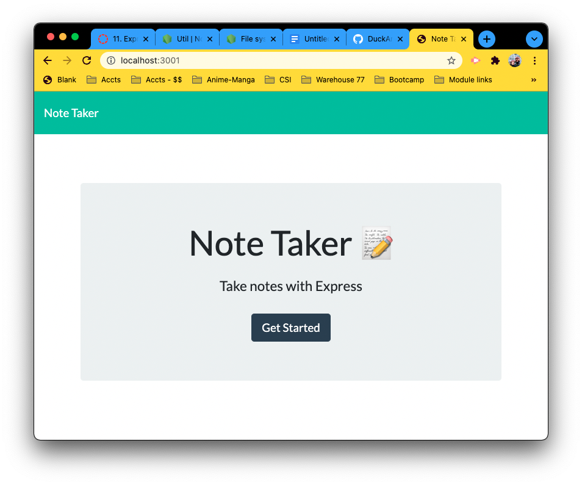
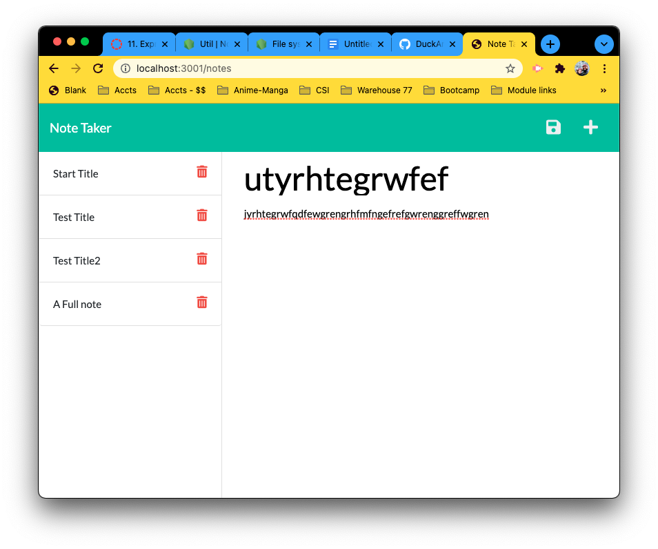
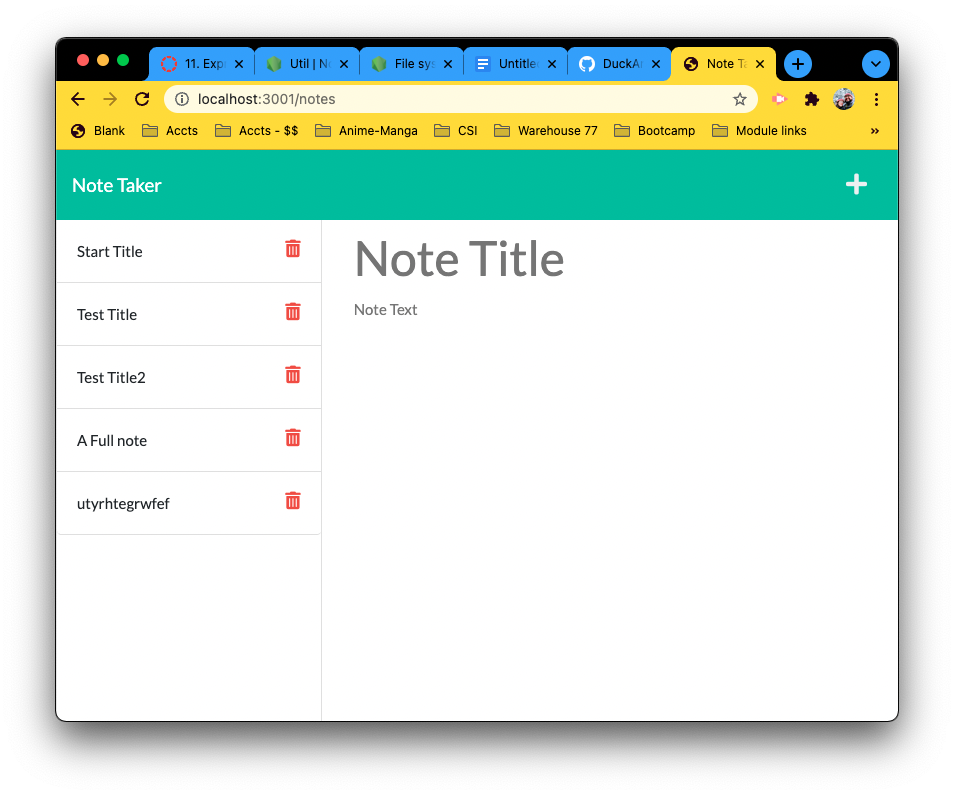
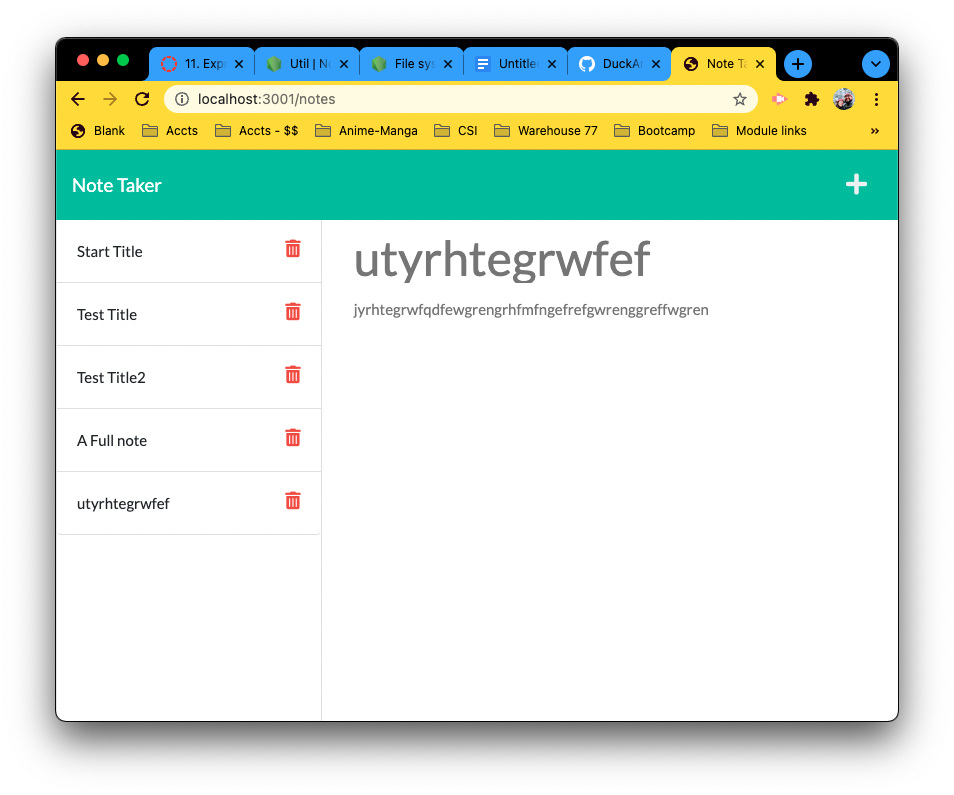

# Note Taker

## UO Coding bootcamp Challenge

Module 11 assignment

## Description

- application connects to back end.
- application stores notes and designates a unique id.
- pending deployment to Heroku. I am not able to install heroku.

## Links

[Github Pages](https://duckarroyo.github.io/noteTaker)

[Github Repository](https://github.com/DuckArroyo/noteTaker)

[Heroku](https://still-sands-24648.herokuapp.com/)

## Required installations for code duplication

npm - npm install

express - npm install express

mysql2 - npm install mysql2

## The commandments

None relevant

# Contributions by:

DeveloperDuckArroyo

[Email](mailto:DeveloperDuckArroyo@gmail.com)

[Portfolio](https://duckarroyo.github.io/challenge2)

[React Portfolio](http://DuckArroyo.github.io/challenge20)

[GitHub](https://github.com/DuckArroyo)

[Twitter @DevDuckArroyo](https://twitter.com/DevDuckArroyo)

[LinkeIn](https://www.linkedin.com/in/duckarroyo)

[CodePen](https://codepen.io/DeveloperDuckArroyo)

# Screnshots

